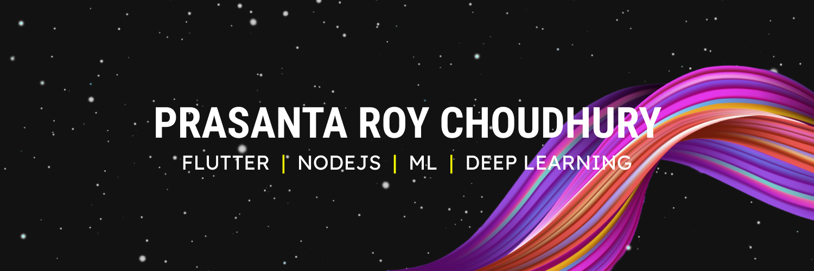

### Hi there 👋 

 

 

I am Prasanta Roy Choudhury. I believe every language has its own beauty, restrictions, and remarkable efforts by each community. So off and on, I like to try out different "Hats" and enjoy the beauty of each programming language.
  Currently, I am vested in Flutter Framework and NodeJs for mobile application development. Keep trying new things with Deep Learning... 😊
  
Hope you will find some helpful content here...

